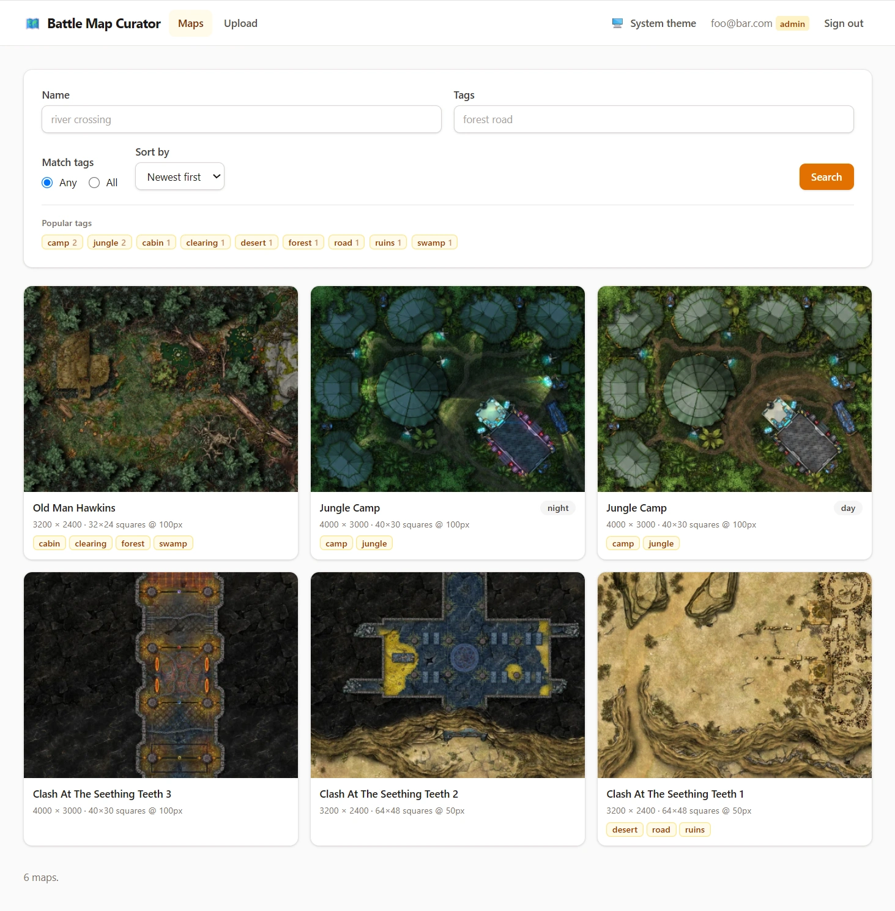

# Battle Map Curator

A private, searchable library of battle maps for tabletop role-playing games.
Upload map images, record the grid geometry so they drop into a virtual tabletop
at the right scale, and find them again by name or tag.

Every page requires a sign-in, and full-resolution maps are served only through
authenticated routes — the image directory is never exposed as static files.



## Requirements

- [Bun](https://bun.com) 1.2.3 or newer (developed against 1.3.14)
- A platform `sharp` supports (Linux, macOS, or Windows on x64/arm64)

## Setup

```bash
bun install
cp .env.example .env # optional; every setting has a default
bun run build        # build the stylesheet
bun run migrate      # create the database
```

Create the first administrator — there is no self-registration, by design:

```bash
bun run cli/user.ts create --email you@example.com --password 'a long passphrase' --role admin
```

Then start the server:

```bash
bun run dev     # rebuilds CSS, then runs with file watching
bun run start   # rebuilds CSS, then runs without file watching
```

Visit <http://127.0.0.1:3000>.

> **Running over plain HTTP?** Session cookies are marked `Secure` by default and
> a browser will refuse to send them back over HTTP, so sign-in will appear to
> silently fail. For a LAN or development box, set `COOKIE_SECURE=false`. In
> production, terminate TLS at a reverse proxy and leave it enabled.

## Accounts

Accounts are managed entirely from the command line. All arguments are supplied
on the command line; nothing is interactive.

```bash
bun run user create          --email a@b.c --password 'secret' --role admin|viewer
bun run user delete          --email a@b.c
bun run user list            [--json]
bun run user change-role     --email a@b.c --role admin|viewer
bun run user change-password --email a@b.c --password 'secret'
```

A password given on the command line is visible to other users through `ps` and
is written to your shell history. Where that matters, pipe it in instead:

```bash
printf '%s' "$PASSWORD" | bun run user create --email a@b.c --password-stdin --role viewer
```

Changing a password or a role signs that account out everywhere.

**Roles**

| | Viewer | Administrator |
|---|:---:|:---:|
| Browse, search, view, download | ✅ | ✅ |
| Upload, edit, delete | — | ✅ |

## Using the app

**Uploading.** PNG, JPG, and WEBP are accepted. Choose a file, drag one onto the
box, or paste the address of one — a link straight to the image file, not to the
page it appears on. An imported image is downloaded and then treated exactly like
a file you picked: the same size limit, the same name and grid read out of its
file name, the same duplicate check. `IMPORT_TIMEOUT_MS` bounds how long the
download may take. Plain `http` addresses are accepted as well as `https`, but
the server will only fetch from a publicly routable address, so a link to
something on your own network is refused.

Every upload is re-encoded for
storage and filed under a fresh UUID v4, with a thumbnail alongside it. What it
is re-encoded to is up to the operator — `IMAGE_FORMAT`, `IMAGE_QUALITY` and
`IMAGE_LOSSLESS`, defaulting to WEBP at quality 95. Set `IMAGE_LOSSLESS=true`
if uploads must be stored bit-for-bit. Each map records the format it was
stored in, so changing these settings affects new uploads only; maps already in
the library keep their files and are still served as what they are.

**Searching.** The last search is remembered — filters, tag matching and sort —
and re-applied whenever the listing is opened without a query of its own, so
opening a map and coming back does not cost you the search. It is restored into
the address bar rather than applied invisibly, so what is on screen is always
what the URL says. *Clear* discards it, and so does signing out.

**Grid geometry.** If the file name ends in square counts — `Forest Road
40x30.png` — they are read into the grid fields on upload and left out of the
derived name. Numbers too large to be a grid are ignored, so a file named after
its resolution is not mistaken for one.

If a map has a painted grid, record the pixels per square
(*grid size*) and how many squares fit across and down. Fill in any one of the
three and the others are worked out for you — enter a grid size of 70 on a
1400×980 map and it records 20×14 squares. On the map's page, *Show grid
overlay* draws the recorded grid over the image so you can check it lines up.

Square counts rarely divide an image evenly: 30 squares across a 1000px map
works out at 33.33px each, which no file can represent. Rather than round it and
leave the recorded grid describing something the image is not, the image is
enlarged the smallest amount that makes the square size whole — here to 1020px,
with 34px squares. This happens on upload and again on an edit that changes
either square count, and `upscale factor` on the map's page reports the total
enlargement since upload. Counts that disagree about how big a square is are
rejected rather than stretched, and an enlargement beyond `GRID_MAX_UPSCALE` or
`MAX_IMAGE_PIXELS` is declined, leaving the grid size rounded as before.

Upload a map with all three fields blank and no square counts in its name, and
the grid is measured off the image itself. A painted grid is the one thing on a
map that repeats, so it shows up as a regular spacing in the gradient summed
down each column and across each row, and the spacing that best fits those is
the size of a square. The map's page reports where the numbers came from:
*Detected automatically* when both axes were measured and agreed, *Estimated —
please check* when only one of them could be read or the square size had to be
rounded. Where nothing convincing is found — no grid, one too faint to read, or
a texture too fine to be one — the map is saved with no grid recorded and can be
edited later to add one, as before.

Detection runs on upload only, and never overrides anything: a value typed into
the form or read out of the file name is used as given. `GRID_MIN_PX` and
`GRID_MAX_PX` bound the square sizes it will consider, `GRID_MIN_CONFIDENCE` how
far a spacing must stand out from the alternatives before it is believed, and
`GRID_ANALYSIS_MAX_DIM` how far a large image is reduced before it is measured.

**Variants.** A variant is an alternate version of the same map — `day`,
`night`, `flooded`. Maps sharing a name are linked to each other, and each
name/variant pair must be unique.

**Duplicate detection.** Every upload is fingerprinted, and if it looks like a
map already in the library the upload pauses rather than joining it. You are
shown what it matched, with the name field already filled in from the closest
match, and asked to give this one a variant — so a second render of a map you
already have lands next to it instead of starting a rival entry. If it really is
a different map, change the name back and save; if it was a mistake, discard it.

The fingerprint is a 64-bit perceptual hash taken from a 32×32 greyscale
reduction of the stored image, so it survives rescaling (including the
enlargement above), re-encoding, cropping, and lighting changes, while two
genuinely different maps land nowhere near each other.
`FINGERPRINT_MAX_DISTANCE` sets how close counts as a match. Maps uploaded
before this existed have no fingerprint and are never offered as matches.

**Finding a better copy.** Battle maps are republished constantly, and the copy
that reaches you is often not the largest one in circulation. If a search
provider is configured, an upload is looked up on the web and any copy that is
meaningfully bigger — and still the same shape — is offered beside it. Choosing
one downloads it, checks its fingerprint really does match what you uploaded and
that it really is larger once decoded, and puts it in place of your file. Your
name, variant and tags stay as you typed them, and nothing joins the library
until you save.

The upload form carries a checkbox, ticked by default, that turns this off for a
single upload. It is worth understanding what it controls: the search works by
giving the provider an address it can fetch the image from, so while a search is
running that one unsaved image is readable by whoever holds an unguessable
token. Untick the box and no such address is ever issued.

This is off unless `WEB_SEARCH_PROVIDER` is set. It needs an API key and a
`PUBLIC_BASE_URL` the provider can actually reach, and the process refuses to
start if either is missing or unusable. Only `serpapi` is implemented, whose
free plan allows 250 searches a month — `WEB_SEARCH_MONTHLY_LIMIT` keeps you
inside it, refilling continuously rather than resetting on a date.

**Searching.** Search by name, by tags, or both. Tags are lowercase letters
only, separated by spaces or commas. Multiple tags can be matched with *Any*
(OR) or *All* (AND). Everything is case-insensitive, and a search is a
bookmarkable URL.

## Configuration

Every setting is read from the environment; Bun loads `.env` automatically. The
process refuses to start if a value is invalid rather than running misconfigured.
See [`.env.example`](.env.example) for the full annotated list.

The settings most worth reviewing:

| Variable | Default | Purpose |
|---|---|---|
| `IMAGE_DIR` | `./data/images` | Where maps are stored. Must be outside `public/`. |
| `DATABASE_PATH` | `./data/bmc.sqlite` | SQLite database file. |
| `MAX_UPLOAD_BYTES` | `25MB` | Largest accepted upload, whether picked or imported. Accepts a `KB`/`MB`/`GB` suffix. |
| `IMPORT_TIMEOUT_MS` | `15000` | How long an image pasted in as an address may take to download. |
| `IMAGE_FORMAT` | `webp` | How maps are stored: `webp`, `png` or `jpeg`. New uploads only. |
| `IMAGE_QUALITY` | `95` | 1–100. JPEG always; WEBP unless lossless; PNG only below 100, as palette quantisation. |
| `IMAGE_LOSSLESS` | `false` | WEBP only, and the only way to store uploads bit-for-bit. Refused with `jpeg`. |
| `COOKIE_SECURE` | `true` | Set `false` only when serving over plain HTTP. |
| `TRUST_PROXY` | `false` | Enable behind a reverse proxy so `X-Forwarded-For` is honoured. |
| `PAGE_SIZE` | `24` | Maps per page. |
| `FINGERPRINT_MAX_DISTANCE` | `10` | Of 64 bits. How alike two maps must look to be reported as duplicates. |
| `PENDING_UPLOAD_TTL_SECONDS` | `3600` | How long an upload awaiting confirmation is kept. |
| `WEB_SEARCH_PROVIDER` | `none` | `none` or `serpapi`. Look for a higher-resolution copy of an upload. |
| `SERPAPI_KEY` | — | Required once a provider is set. |
| `PUBLIC_BASE_URL` | — | Required once a provider is set: the https origin it fetches staged images from. |
| `WEB_SEARCH_MONTHLY_LIMIT` | `250` | Searches per rolling month, matching the free plan. |
| `LOG_LEVEL` | `info` | `debug`, `info`, `warn`, or `error`. |

## Security

The app follows the OWASP Top Ten. In brief:

- **Access control is deny-by-default.** Authentication is applied at the root,
  with an explicit list of public paths, so a newly added route is private until
  someone opts it out. Every mutating route additionally requires an admin.
- **Full-resolution maps require authentication.** `IMAGE_DIR` is never mounted
  statically; the only readers are routes behind the auth middleware. Image
  paths are built from a UUID that has been pattern-matched first, so traversal
  is impossible by construction rather than by filtering.
- **One route is an exception, and only when you enable it.** Reverse image
  search works by giving the provider an address to fetch, so `/staged-image`
  answers without a session. It serves one upload that is not yet a map, to
  whoever presents a 256-bit token stored only as a SHA-256, for five minutes,
  revoked the moment the search returns — and issued at all only when a provider
  is configured *and* the admin left the box ticked. With `WEB_SEARCH_PROVIDER`
  unset, no token is ever minted and the route can only answer 404.
- **Images fetched from the web are treated as hostile.** A candidate URL is
  https-only, its host is resolved and refused if any address is private,
  loopback, link-local or otherwise internal, every redirect is re-checked the
  same way, and the body is capped both by its declared length and by what
  actually arrives. The bytes are then identified by their leading bytes and
  fully re-encoded, exactly as an upload is.
- **Passwords** are hashed with Argon2id at OWASP's recommended cost. Sign-in is
  rate limited per client *and* per account, and an unknown address costs the
  same time and yields the same message as a wrong password.
- **Sessions** are server-side. The cookie holds a 256-bit random token; only
  its SHA-256 is stored, so a database backup yields no usable sessions. Both an
  idle timeout and an absolute lifetime apply.
- **CSRF protection is two-layered**: origin validation plus a synchroniser
  token in every form, including the sign-in form while signed out.
- **Injection** is prevented by prepared statements throughout. Search terms are
  quoted before reaching FTS5, so operators such as `OR` and `*` are matched as
  text rather than executed. All template output is escaped by default.
- **Uploads** are identified by their leading bytes, not by the filename or the
  browser-supplied content type, and are fully re-encoded — which also strips
  any embedded metadata payload.
- **A strict CSP** with no `unsafe-inline` for scripts or styles. The one
  dynamic style the app needs carries a per-request nonce.

Review dependencies with `bun pm audit`.

### Reporting

If you find a security problem, please report it privately to the maintainer
rather than opening a public issue.

## Development

```bash
bun run test      # run full test suite
bun run typecheck # tsc --noEmit
```

### Layout

```
src/
  config.ts     log.ts     errors.ts     server.tsx
  db/           schema and forward-only migrations
  models/       users, maps, staged uploads, upgrade candidates, tags, search
  auth/         password hashing, sessions, access-control middleware
  security/     CSRF, response headers, rate limiting
  images/       storage sharding, upload processing, grid geometry, fingerprints
  websearch/    finding a higher-resolution copy, and fetching it safely
  routes/       auth, maps, admin, files, static
  views/        server-rendered components
cli/user.ts     account management
tests/          unit and end-to-end suites
```

Images are sharded across 256 directories named for the first two characters of
each UUID, so no single directory grows unwieldy:

```
data/images/60/601eece7-4038-4922-9f64-8cc2247f7bd3.webp
data/images/60/601eece7-4038-4922-9f64-8cc2247f7bd3_thumb.webp
```

### Notes on the design

- **No client-side framework.** Pages are server-rendered with `hono/jsx`. The
  app is fully usable with JavaScript disabled; `public/app.js` only adds an
  instant theme switch and a delete confirmation.
- **Light and dark mode need no JavaScript.** A cookie records the preference
  and the server renders the matching class, so the first paint is already
  correct. With no preference set, CSS follows the operating system.
- **Thumbnails are lossy** (quality 90 by default); stored maps may be lossy
  depending on configuration.

## Deployment

Run behind a reverse proxy that terminates TLS, and set `TRUST_PROXY=true` so
rate limiting sees real client addresses. Back up two things: the SQLite
database and `IMAGE_DIR`.

## License

MIT — see [LICENSE](LICENSE).
